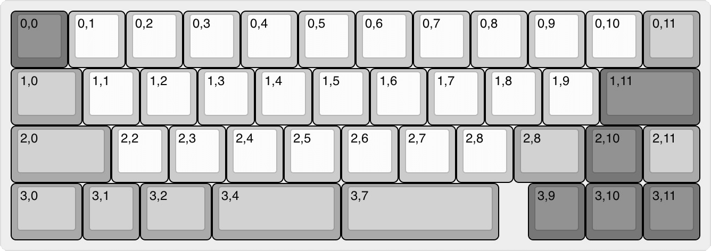

# SR42-Keyboard-PCB

> :warning: **WIP:** Work in Progress design, and is not tested.  Please hold-off on building until the design can be verified and the software is written.

## Intent

A 42-key micro *(40%)* keyboard designed for QMK with specific focus on ultra fast key scan rates / poll rates to make for an ideal gaming keyboard.

#### Progression

> :bangbang: This is a "when I'm bored" project - so "significant" progress is not expected.

- See [CHANGELOG.md](CHANGELOG.md)

## Case

This case is designed in conjunction with the [SR42 Keyboard Case](https://github.com/tecsmith/sr42-keyboard-case).  These two projects are mutually inclusive and built as one solution.

> :bangbang: :warning: Please note the case is currently for the v0.1 PCB, and will not work with the current KiCAD redo.

<!--
## Resources

### Schematic
 - PDF [here](docs/sr42-revB.pdf)

### MCU PCB
 - EAGLE BRD *(PCB)* [here](EAGLE/sr42/sr42-revB-kbd.brd)
 - EAGLE SCH *(Schematic)* [here](EAGLE/sr42/sr42-revB-kbd.sch)

### Key Switch PCB
 - EAGLE BRD *(PCB)* [here](EAGLE/sr42/sr42-revB-kbd.brd)
 - EAGLE SCH *(Schematic)* [here](EAGLE/sr42/sr42-revB-kbd.sch)
<!--

<!--
### Beta PCB renders

#### Top

#### Bottom *(Component side)*

#### Intra-Board Connectors

You will need 3x Molex Pico-EZMate cables

|                                                                 | Cable | Usage                                |
|:---------------------------------------------------------------:|:-----:|:-------------------------------------|
| </img> | 6 way | Keyboard Matrix SPI interface        |
| </img> | 4 way | USB connection to UBD                |
| </img> | 3 way | ARGB to drive status & per-key LED's |

-->

### Layout ideation renders

#### Render

#### Layout

#### Matrix coordinates *(QMK & VIA)*

## Planned Features

- [ ] QMK build, with Via/l<i>/ReMAP</i> support
- [ ] 1x `STM32F405` STM32 CPU *(ft. dual USB, one is FS, the other HS)*
- [ ] 1x `TS3USB221` USB 2.0 Multiplexer for USB port selection *(based on the [akeypad](https://github.com/luantty2/akeypad) project)*
- [ ] 1x `USB3300-EZK` Hi-Speed USB Host for OTG PHY pin interface
- [ ] 1x `M95640-DRE` 8K SPI EEPROM Module
- [ ] 6x `MC74HC589A` SPI Input Shift Registers
    - No QMK key matrix, using all direct pins for faster scan rates
    - Scan via individually grounded keys on shift registers
- [ ] `SK6812` ARGB per-key LED's, but these feature power down circuitry
- [ ] Build as a 2 part PCB, one being the switch stack, and the other the MCU on a custom [UDK Module](https://github.com/Tecsmith/udk_module_mcus)

## Possible BIG issues

- [ ] ~~Not sure QMK can handle High Speed USB~~ *[It can, just now need to do it :( )]*
- [ ] Not sure dual USB is switchable with the USB multiplexer *[Needs to be coded for and tested]*
    - FS USB required for Bootloader
    - HS USB required for >1KHz polling rates

&nbsp; &nbsp;
---
Made with :heart: by [**Silvino R**](https://github.com/silvinor)